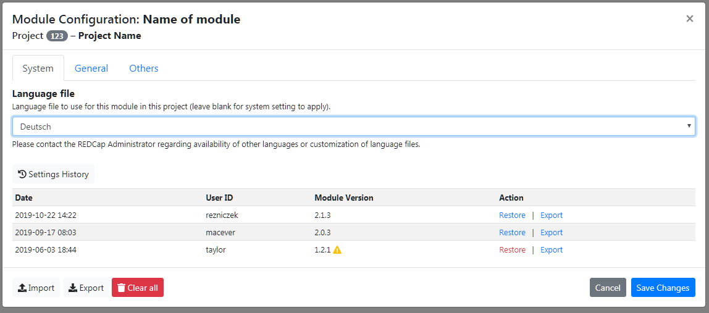
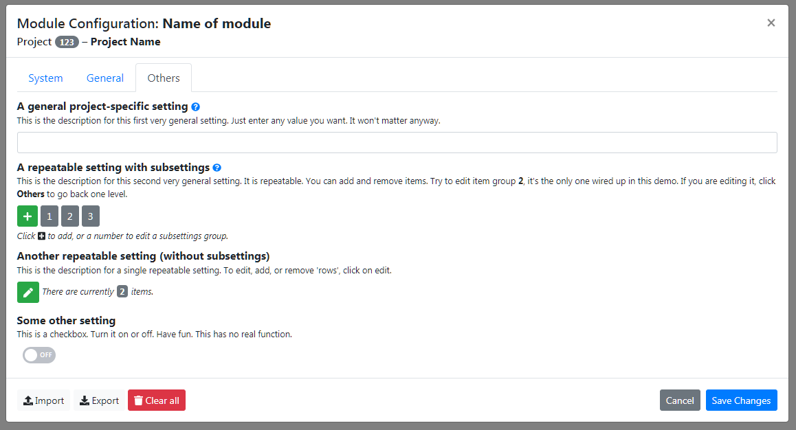
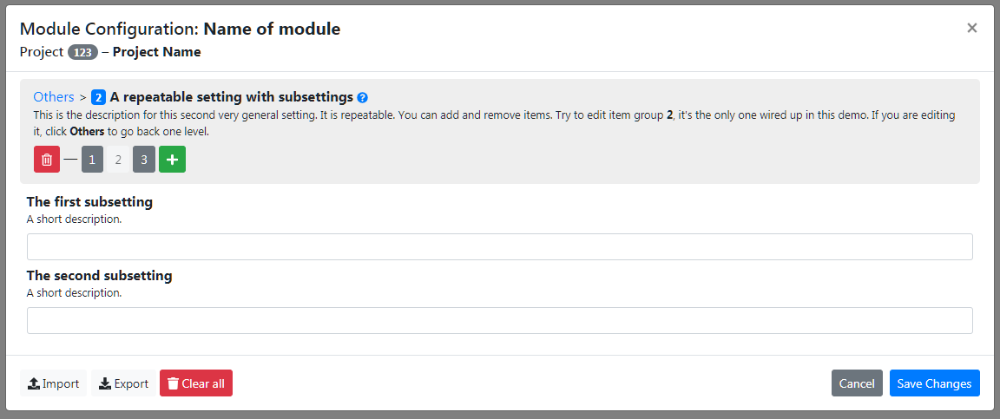

# REDCap EM Configuration Design Study

This is a _very_ **preliminary** design study to help discussion of how to improve capability and user experience of the REDCap External Module configuration system.

## How to use

Currently, this is only a static HTML page. So to see the demo, there are two options.

- Access the HTML directly:
  1. Clone this repo (anywhere on your local machine).
  1. Then, head over to the `static-demo` folder, and open `config-dialog.html` in a browser.

- Install as an External Module:
  1. Clone this repo into your `modules` folder.
  1. Add a version to the folder's name, so it reads, e.g., `redcap_em_config_study_v0.0.1`.
  1. Enable the EM in _Command Center &gt; External Modules_.
  1. There will be a link 'Configuration Design Study' in the 'Control Center &gt; External Modules' section.

The HTML will generate some 404 errors in the browser's console. This is normal, as for it to work both ways, some CSS and JS has to be loaded two ways, only one of which will work depending on whether the HTML is accessed directly or through the EM framework.

The External Module version has some settings defined in `config.json` that illustrate and comment on what is broken in the current config dialog. This is not complete.

**Note:** This is built on Bootstrap 4, so it should ultimately work fine inside of REDCap without loading any dependencies. Currently, however, Bootstrap and dependencies are loaded from CDN, so this demo may not work off the network.

## Features

- For project settings, the project id and name will be shown. For system settings, this will say '_Global System Settings_'.
- Settings can be organized in tabs.
  - The _System_ tab is always there and hosts the settings provided directly by the EM Framework.
  - If no tabs are defined in `config.json`, a tab named _Module_ will be added automatically.
- Descriptions and help texts can be defined in `config.json` and will be shown with appropriate styling or as a modals in case of help.
- The currently shown settings can be exported or imported (from JSON files).
- A settings history is provides (needs a new table in the backend). Accessible via the _System_ tab. Old settings can be restored (i.e. copied to the dialog, still need to be saved to apply) or exported. List is retrieved from server on demand, incompatible settings due to version differences will be noted via warnings (best effort restore). This can be determined via a diff of current settings keys and levels with those in the stored settings. The history table stores JSON as would be exported.
- Checkboxes are shown as toggles. See the _Others_ tab for an example.
- Repeatable settings are handled either embedded/nested, or in a edited on separate screens. The _General_ tab demonstrates the first way, the _Others_ tab the other. The latter is probably the better way, as less scrolling will be needed and no indentations will be needed.

## Walk-through

1. Load the HTML. The dialog should auto-start. Otherwise click on _Open Configuration Modal_.
1. Explore the dialog tab. Resize the browser window. The modal should adjust.
1. Footer allows to import/export configurations. _Clear all_ will reset the settings to default states (and remove any repeated items).
1. Click on _Settings History_. This button toggles the table.
1. Go to the _General_ tab.
1. Additional field help can be provided. If so, a help icon is available. Clicking on this will show another modal with the help text. HTML is allowed. Click anywhere (or on the close button) to exit the help modal.
1. In the _General_ tab, repeated subsetting groups or repeatable settings are shown inline. This may lead to a lot of scrolling (one of the drawbacks of the current settings dialog) for long/complex configurations.
1. Go to the _Others_ tab.
1. Here, repeatable fields or subsetting groups are only referred to and give an indication of their size (number of items). Editing will be done on separate "pages".
1. Click on _A repeatable setting with subsettings_, number 2.
1. Here, a navigation is shown on top, showing where the setting being edited is located. If the nesting is deeper, this will be reflected in the breadcrumbs row.
1. Below the breadcrumbs, options to delete the current repeat instance or to jump to others, or to add a new one are offered.
1. Finally, the subsettings fields are shown.
1. Click on 'Others' in the breadcrumbs to go back.
1. Now click the pen button under the _Another repeatable setting (without subsettings)_ field.
1. Breadcrumb as before at the top.
1. Repeated items are shown as a list. Individual items can be removed with the trash-can link, or a new item added with the + button.

## Screenshots

### System-provided settings, including history:

### A project-settings tab:

### Editing details of a repeating subsettings block:

